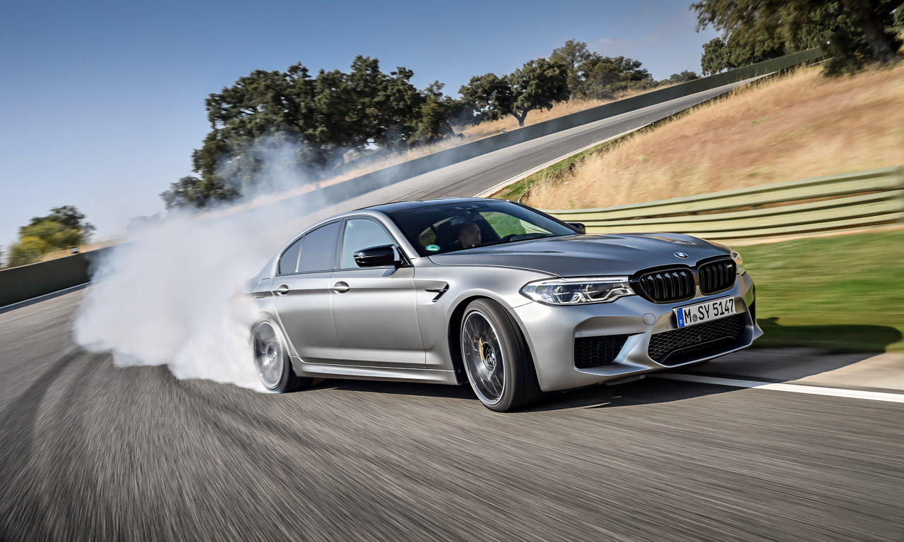
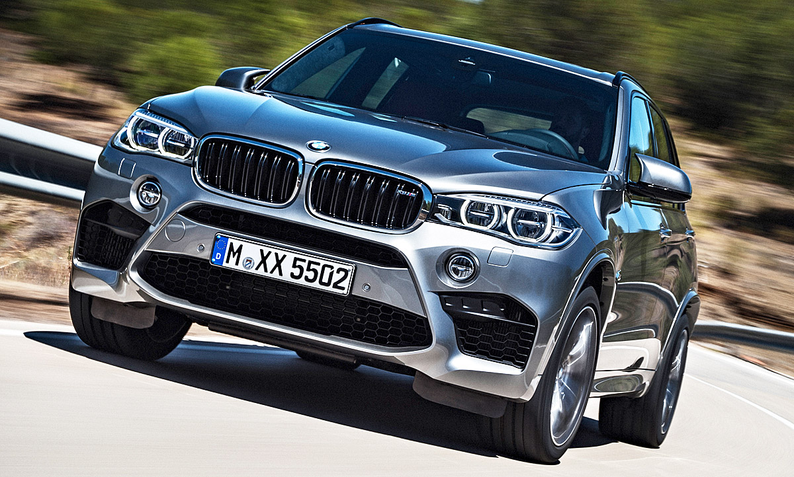
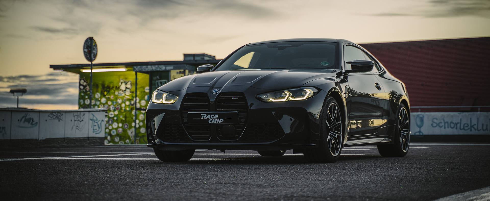
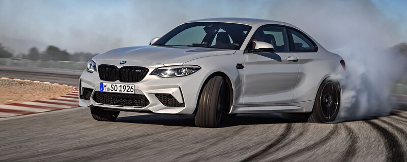

Unveiling the Powerhouses: The Strongest BMW Cars
BMW, recognized for its precision engineering and performance-oriented vehicles, has produced several models that stand out as powerhouses in the automotive realm. These cars blend cutting-edge technology, high-performance engines, and aerodynamic designs, delivering exhilarating driving experiences. Let's delve into some of the strongest BMW cars that have captivated enthusiasts worldwide:

1. **BMW M5 Competition:**

[**Here is a video of a BMW M5 F90 Competition Accerleration:**](https://youtu.be/bnyZKZo_xmE?si=j10vS5qpdCcS9vF6)

The BMW M5 Competition is a pinnacle of performance, combining luxury with extraordinary power. Fitted with a 4.4-liter twin-turbocharged V8 engine, it produces a remarkable 617 horsepower, enabling a blistering 0-60 mph acceleration in just 3.1 seconds. This sedan's refined interior, advanced technology, and dynamic driving capabilities make it a compelling choice for those seeking ultimate performance and luxury in a four-door car.

2. **BMW M8 Competition:**

The BMW M8 Competition series encompasses the M8 Coupe, M8 Gran Coupe, and M8 Convertible, all showcasing breathtaking power and style. Equipped with a 4.4-liter V8 engine, these vehicles churn out up to 617 horsepower, propelling them from 0 to 60 mph in a mere 3 seconds. With a perfect blend of opulence and track-ready performance, the M8 lineup represents the epitome of BMW's engineering prowess.

3. **BMW X5 M and X6 M:**

The BMW X5 M and X6 M models redefine the concept of SUVs with their incredible power and agility. Packing a 4.4-liter V8 engine producing 600+ horsepower, these high-performance SUVs accelerate from 0 to 60 mph in around 3.8 seconds. With sport-tuned suspensions and advanced all-wheel drive systems, they offer an exhilarating driving experience while maintaining the versatility of an SUV.

4. **BMW M4 Competition:**

The BMW M4 Competition Coupe and Convertible models exemplify raw power combined with exceptional handling. Their 3.0-liter twin-turbocharged inline-6 engine generates up to 503 horsepower, enabling lightning-fast acceleration and precise handling capabilities. These models are revered for their track performance, aerodynamic design, and driver-focused features, making them a favorite among enthusiasts.

5. **BMW M2 Competition:**

The BMW M2 Competition, despite being smaller in size, doesn't compromise on performance. With a 3.0-liter inline-6 engine producing 405 horsepower, this compact sports car accelerates from 0 to 60 mph in just over 4 seconds. Its nimble handling, aggressive styling, and driver-centric design make it a thrilling choice for driving enthusiasts seeking an engaging and powerful driving experience.

Conclusion:
BMW's lineup of high-performance vehicles showcases a blend of power, innovation, and sophistication, setting benchmarks in the automotive industry. Whether it's the sedans, coupes, convertibles, or SUVs, each model represents BMW's commitment to engineering excellence, delivering unparalleled performance and driving pleasure to enthusiasts around the globe.
