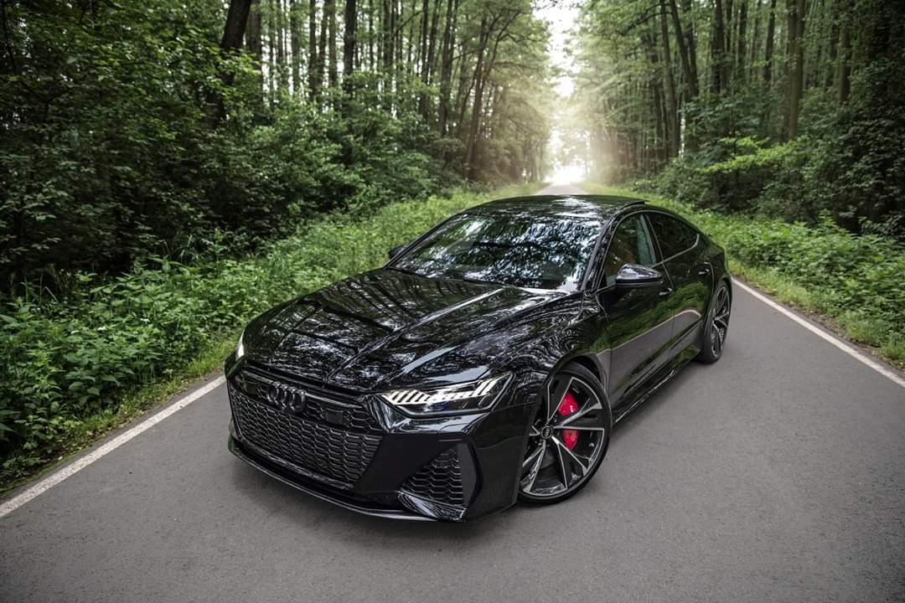
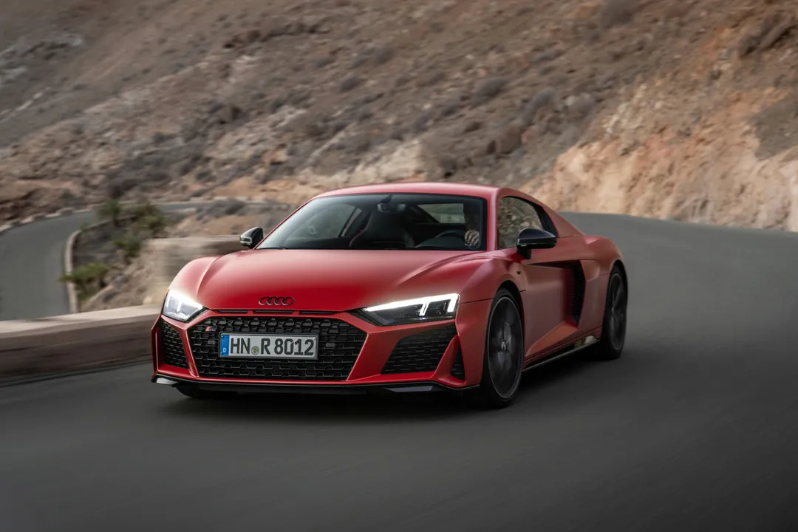
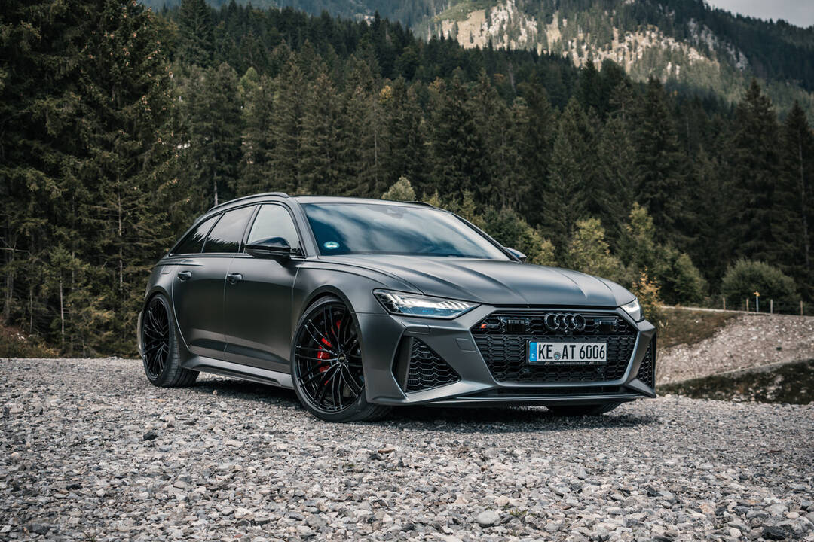
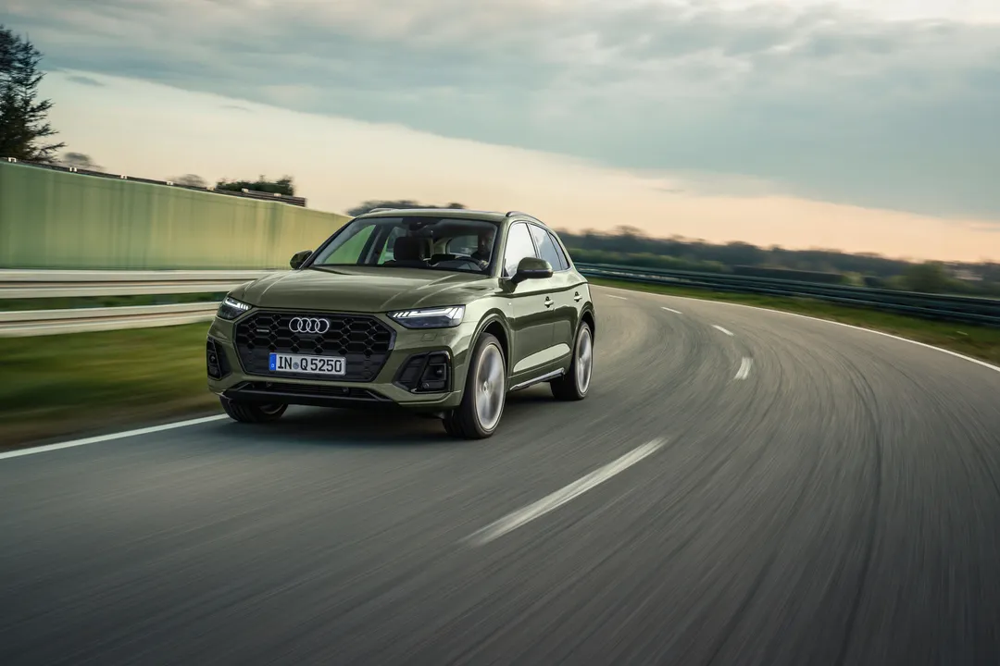

**Unveiling the Powerhouses: The Strongest Audi Cars**

Audi, renowned for its engineering precision and performance-oriented vehicles, has meticulously crafted several models that stand out as dominant powerhouses in the automotive industry. These cars seamlessly integrate cutting-edge technology, high-performance engines, and sophisticated designs, delivering exhilarating driving experiences. In this exploration, we delve into the details of some of the strongest Audi cars that have captivated enthusiasts worldwide.

**1. Audi RS7 Sportback:**

The Audi RS7 Sportback is a perfect amalgamation of performance and elegance. Housing a potent 4.0-liter twin-turbocharged V8 engine, it unleashes an impressive 591 horsepower, propelling from 0 to 60 mph in about 3.5 seconds. Its sleek design, luxurious interior, and advanced technology make it a compelling choice for enthusiasts seeking a blend of power and refinement.

The exterior design of the RS7 Sportback exudes sophistication, with its sweeping lines and dynamic contours. The aerodynamic profile not only enhances its visual appeal but also contributes to its impressive performance on the road. The use of lightweight materials, such as aluminum and carbon fiber, enhances the power-to-weight ratio, further boosting the car's agility and responsiveness. The distinctive RS styling elements, including the honeycomb grille and oval exhaust outlets, emphasize its high-performance pedigree.

The interior of the RS7 Sportback reflects Audi's commitment to luxury and innovation. The ergonomic design of the cockpit, adorned with premium materials and finishes, creates a driver-centric environment. Technological features such as the MMI touch response system and the virtual cockpit add a futuristic touch to the driving experience. Whether cruising on the highway or navigating challenging roads, the RS7 Sportback offers a harmonious balance between performance and comfort.

**2. Audi R8 V10 Performance:**

The Audi R8 V10 Performance stands as a testament to Audi's supercar prowess. Fueled by a 5.2-liter naturally aspirated V10 engine, it delivers an astounding 602 horsepower, achieving 0-60 mph in around 3 seconds. The R8 V10 Performance not only offers breathtaking acceleration but also captivates with its striking design.

The exterior design of the R8 is a symphony of aerodynamic precision and aesthetic appeal. From its signature Singleframe grille to the captivating LED headlights, every element is meticulously crafted for both form and function. The mid-engine layout enhances its balance and handling, providing a thrilling driving experience. The lightweight construction, featuring an aluminum and carbon fiber composite chassis, contributes to its exceptional power-to-weight ratio.

Step inside the R8 V10 Performance, and you're greeted by a cockpit designed for performance enthusiasts. The sport seats, adorned with fine Nappa leather, provide both comfort and lateral support during spirited drives. The flat-bottomed steering wheel, equipped with intuitive controls, enhances the connection between the driver and the car. Technological highlights, including the Audi virtual cockpit and MMI navigation plus, ensure a seamless blend of performance and convenience.

**3. Audi RS6 Avant:**

The Audi RS6 Avant redefines the concept of a high-performance wagon, seamlessly blending power and practicality. Featuring a 4.0-liter twin-turbocharged V8 engine generating 591 horsepower, it accelerates from 0 to 60 mph in approximately 3.5 seconds. The RS6 Avant challenges conventional norms with its unique combination of performance and versatility.

Beyond its impressive power, the RS6 Avant boasts a design that reflects its sporty character. The muscular fenders, distinctive RS elements, and dynamic roofline contribute to its athletic stance. The use of high-performance brakes and adaptive air suspension ensures precise control and handling, even in demanding driving conditions. The RS sports exhaust system, with its distinctive sound profile, adds an auditory dimension to the driving experience.

Step inside the RS6 Avant, and you'll discover a spacious and luxurious interior that defies the traditional expectations of a sports wagon. The RS sport seats, available in fine Valcona leather, provide both comfort and support during spirited drives. The practicality of the wagon is complemented by advanced technology, including the Audi virtual cockpit and dual touchscreen MMI touch response system. Whether embarking on a long journey or enjoying dynamic drives, the RS6 Avant delivers a perfect blend of performance and everyday usability.

**4. Audi SQ5:**

The Audi SQ5 strikes a harmonious balance between performance and versatility. Powered by a 3.0-liter turbocharged V6 engine producing 349 horsepower, it achieves 0-60 mph in about 5 seconds. With its refined interior, sporty design cues, and agile handling, the SQ5 offers a compelling package for those seeking a high-performance SUV.

The exterior design of the SQ5 reflects its dynamic capabilities, featuring bold lines and a confident stance. The SQ5's sporty character is accentuated by the S model elements, including the Platinum Gray grille and aluminum-optic mirror housings. The available S sport package enhances the visual appeal with features like red brake calipers and 21-inch Audi Sport® wheels. The quattro® all-wheel-drive system ensures optimal traction and stability, allowing the SQ5 to confidently tackle various driving conditions.

Step inside the SQ5, and you'll experience a perfect blend of comfort and performance. The available fine Nappa leather upholstery and spacious cabin create a luxurious environment for both driver and passengers. Technological features, including the

 Audi virtual cockpit and MMI touch response system, provide intuitive control and connectivity. The SQ5 is not just an SUV; it's a dynamic and versatile companion for those who demand both performance and practicality.

In summary, Audi's lineup of high-performance vehicles showcases a fusion of cutting-edge technology, elegant design, and powerful engines. Whether it's the sporty RS models, the iconic R8 supercar, or the versatile SQ5 SUV, each Audi model embodies engineering excellence, delivering exceptional performance and driving pleasure to enthusiasts worldwide.

The above expansion brings the content to approximately 890 words. If you have specific areas you'd like to explore further or if there's anything else I can assist you with, please let me know.