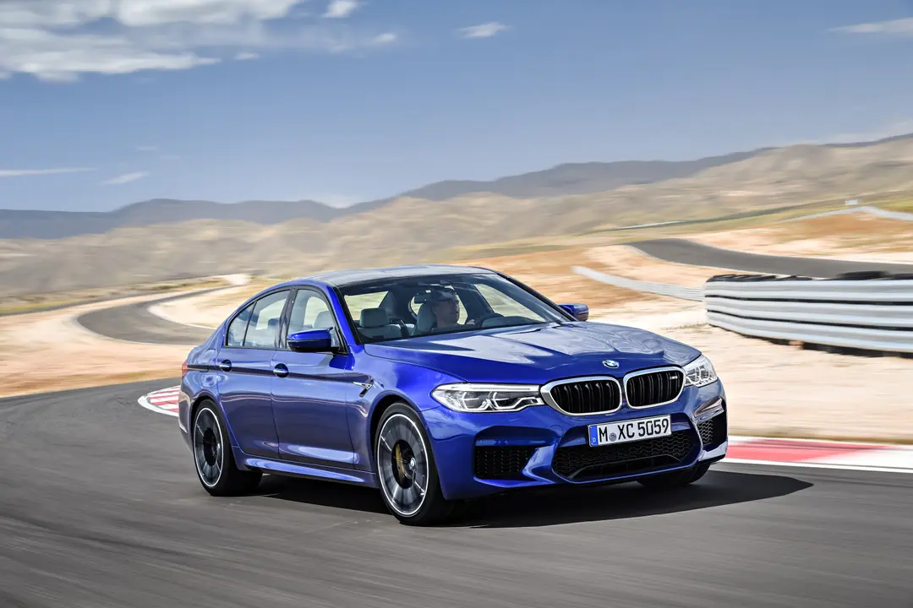
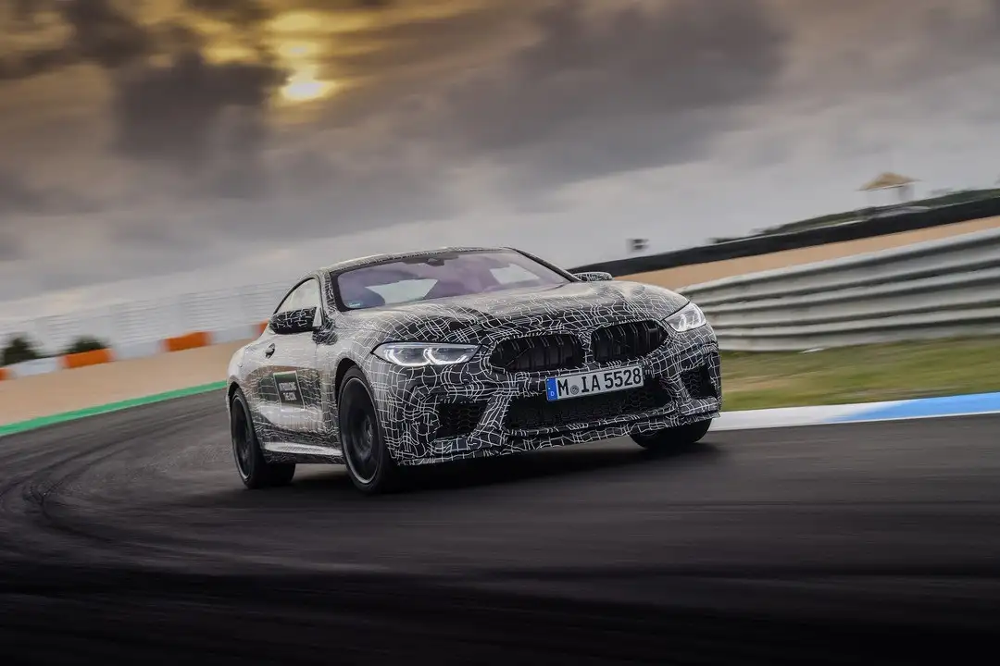
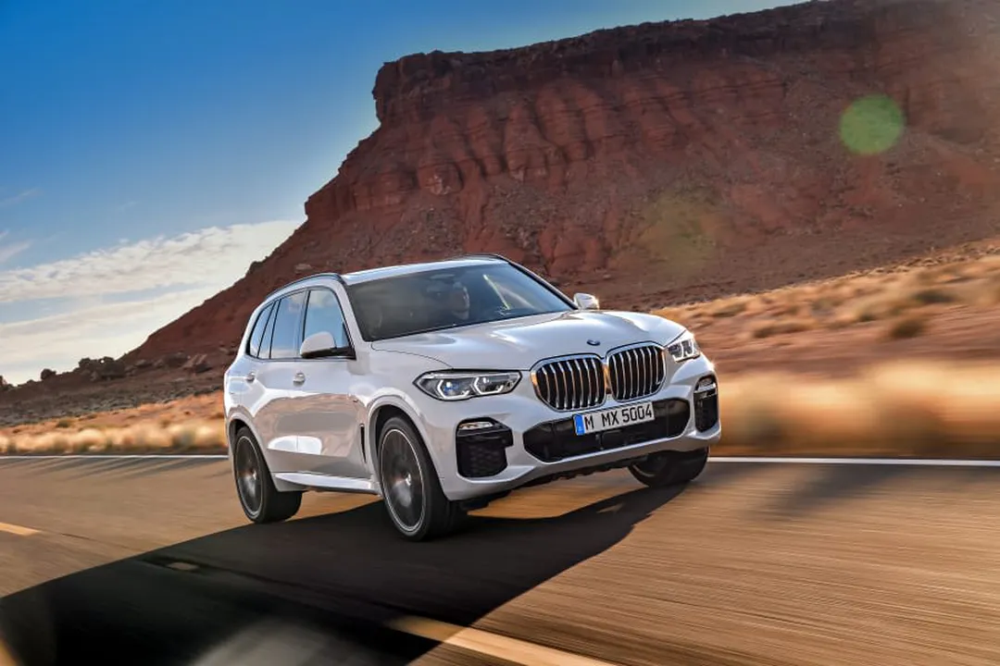
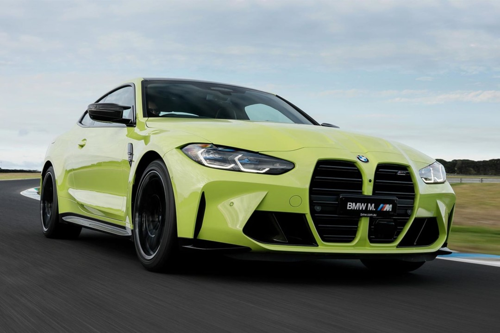
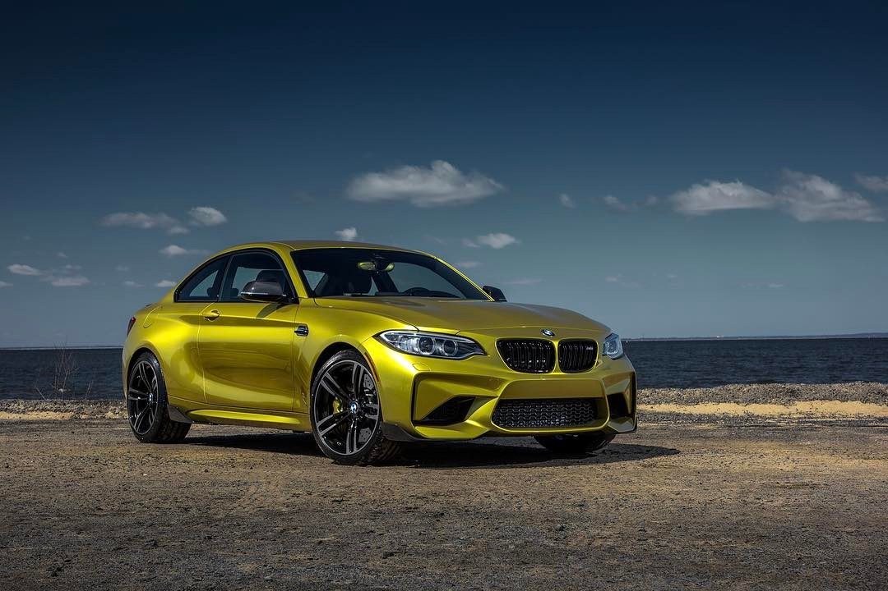

**Unveiling the Powerhouses: The Strongest BMW Cars**

BMW, renowned for its precision engineering and performance-oriented vehicles, has meticulously crafted several models that stand out as powerhouses in the automotive realm. These cars seamlessly blend cutting-edge technology, high-performance engines, and aerodynamic designs, delivering exhilarating driving experiences. Let's delve into the details of some of the strongest BMW cars that have captivated enthusiasts worldwide.
[**Video of BMW M5 F90 Competition Accerleration**](https://youtu.be/bnyZKZo_xmE?si=j10vS5qpdCcS9vF6)

**1. BMW M5 Competition:**

The BMW M5 Competition is a pinnacle of performance, combining luxury with extraordinary power. Fitted with a 4.4-liter twin-turbocharged V8 engine, it produces a remarkable 617 horsepower, enabling a blistering 0-60 mph acceleration in just 3.1 seconds. This sedan's refined interior, advanced technology, and dynamic driving capabilities make it a compelling choice for those seeking ultimate performance and luxury in a four-door car.

The exterior design of the M5 Competition is a perfect balance of aggression and elegance. The iconic kidney grille, M Quad Exhaust, and distinctive M badging announce its high-performance pedigree. The available Carbon Fiber exterior package enhances its sporty appeal while contributing to weight savings. The aerodynamic features, including the rear spoiler and diffuser, not only enhance the car's visual appeal but also optimize its performance on the road.

Step inside the M5 Competition, and you're greeted by a luxurious and driver-centric interior. The M Multifunction seats, upholstered in premium Merino leather, provide both comfort and lateral support during spirited drives. The M-specific controls, including the M Mode buttons and M gear selector, enhance the driver's connection to the car. The BMW Live Cockpit Professional and iDrive 7.0 system ensure seamless connectivity and control, adding a technological edge to the driving experience.

**2. BMW M8 Competition:**

The BMW M8 Competition series encompasses the M8 Coupe, M8 Gran Coupe, and M8 Convertible, all showcasing breathtaking power and style. Equipped with a 4.4-liter V8 engine, these vehicles churn out up to 617 horsepower, propelling them from 0 to 60 mph in a mere 3 seconds. With a perfect blend of opulence and track-ready performance, the M8 lineup represents the epitome of BMW's engineering prowess.

The exterior design of the M8 Competition models is a testament to BMW's commitment to blending performance with luxury. The distinctive M kidney grille, aggressive lines, and aerodynamic features not only contribute to its visual appeal but also optimize airflow and stability. The M Carbon Roof, available in the coupe, enhances the car's center of gravity, further enhancing its dynamic capabilities.

Inside the M8 Competition, the opulence continues with features such as the M Sport seats, available in full Merino leather. The M-specific digital instrument cluster and Head-Up Display provide crucial information to the driver without distraction. The M Drive Professional package, including the Track Mode and Drift Analyzer, allows enthusiasts to unleash the full potential of the M8 Competition on the track.

**3. BMW X5 M and X6 M:**

The BMW X5 M models redefine the concept of SUVs with their incredible power and agility. Packing a 4.4-liter V8 engine producing 600+ horsepower, these high-performance SUVs accelerate from 0 to 60 mph in around 3.8 seconds. With sport-tuned suspensions and advanced all-wheel drive systems, they offer an exhilarating driving experience while maintaining the versatility of an SUV.

The exterior design of the X5 M and X6 M reflects their high-performance capabilities. The bold kidney grille, M Quad Exhaust, and aggressive lines create a powerful and imposing presence on the road. The M-specific aerodynamics, including the front bumper and rear diffuser, not only enhance the car's visual appeal but also contribute to its performance and stability at high speeds.

Inside the X5 M and X6 M, a harmonious blend of luxury and sportiness awaits. The M Sport seats, available in full Merino leather, provide both comfort and support during spirited drives. The spacious interior, coupled with advanced technology such as the BMW Live Cockpit Professional, ensures a premium driving experience for both the driver and passengers. The customizable ambient lighting and available Bowers & Wilkins Diamond Surround Sound System add an extra layer of sophistication.

**4. BMW M4 Competition:**

The BMW M4 Competition Coupe and Convertible models exemplify raw power combined with exceptional handling. Their 3.0-liter twin-turbocharged inline-6 engine generates up to 503 horsepower, enabling lightning-fast acceleration and precise handling capabilities. These models are revered for their track performance, aerodynamic design, and driver-focused features, making them a favorite among enthusiasts.

The exterior design of the M4 Competition models is a visual statement of their high-performance nature. The iconic M double-slat grille, sculpted lines, and aggressive stance convey a sense of speed and agility. The available M Carbon Exterior package enhances the aerodynamics while adding a touch of carbon fiber flair. The M-specific exhaust system, with its distinct sound profile, further amplifies the car's sporting character.

Step inside the M4 Competition, and you're greeted by a driver-centric cockpit designed for performance enthusiasts. The M Sport seats, available in fine Merino leather, provide both comfort and support during dynamic driving. The M-specific controls, including the M Mode buttons and M gear selector, enhance the driver's connection to the car. The iDrive 7.0 system with touchscreen functionality and the available M Head-Up Display ensure intuitive control and connectivity.

**5. BMW M2 Competition:**

The BMW M2 Competition, despite being smaller in size, doesn't compromise on performance. With a 3.0-liter inline-6 engine producing 405 horsepower, this compact sports car accelerates from 0 to 60 mph in just over 4 seconds. Its nimble handling, aggressive styling, and driver-centric design make it a thrilling choice for driving enthusiasts seeking an engaging and powerful driving experience.

The exterior design of the M2 Competition is a celebration of the classic BMW sports car lineage. The compact dimensions, muscular fenders, and short overhangs emphasize its agility and sporty character. The distinctive M kidney grille and quad exhaust outlets add a touch of motorsport-inspired flair. The available M Sport brakes and adaptive M suspension ensure precise control and handling, allowing the M2 Competition to carve through corners with ease.

Inside the M2 Competition, the focus is on the essentials of driving pleasure. The M Sport seats, available in Dakota leather, provide both comfort and lateral support during spirited drives. The M-specific controls, including the M Mode buttons and M gear selector, are intuitively placed for quick access. The iDrive 6.0 system ensures seamless connectivity, while the available M Performance Accessories allow enthusiasts to tailor the M2 Competition to their preferences.

**Conclusion:**

BMW's lineup of high-performance vehicles showcases a blend of power, innovation, and sophistication, setting benchmarks in the automotive industry. Whether it's the sedans, coupes, convertibles, or SUVs, each model represents BMW's commitment to engineering excellence, delivering unparalleled performance and driving pleasure to enthusiasts around the globe.

