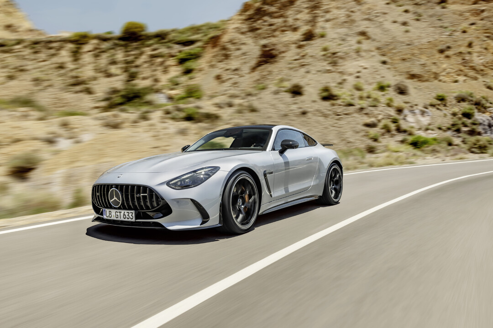
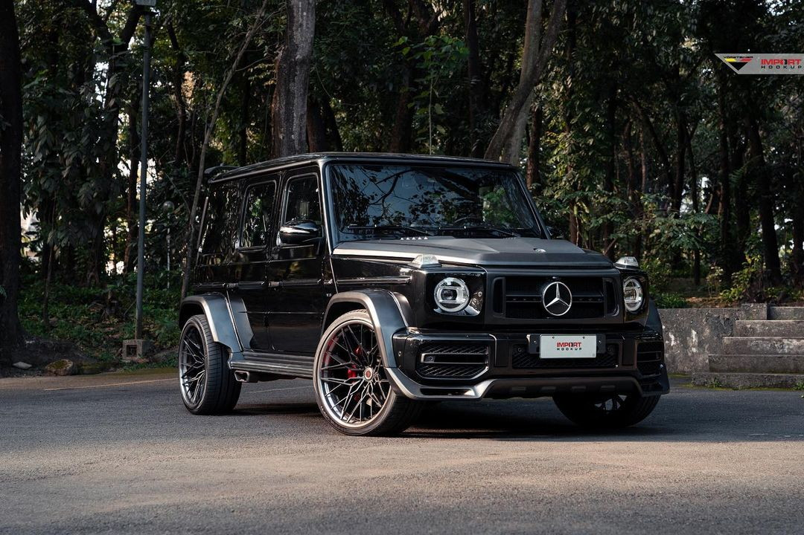

**Unveiling the Powerhouses: The Strongest Mercedes-AMG Cars**

Mercedes-AMG, renowned for its high-performance and luxury automobiles, has crafted several models that represent the pinnacle of automotive engineering. These vehicles seamlessly integrate advanced technology, potent engines, and sleek designs, offering thrilling driving encounters. Let's explore some of the formidable Mercedes-AMG cars that have enamored enthusiasts worldwide:

1. **Mercedes-AMG GT Black Series:**

   The Mercedes-AMG GT Black Series stands as a pinnacle of AMG's engineering excellence, blending remarkable power with track-focused capabilities. Featuring a handcrafted 4.0-liter twin-turbocharged V8 engine, it delivers an astounding 720 horsepower, enabling 0-60 mph acceleration in approximately 3 seconds. With its aerodynamic design and advanced engineering, the GT Black Series provides an unparalleled driving experience for enthusiasts seeking ultimate performance.

2. **Mercedes-AMG E63 S Sedan:**

   The Mercedes-AMG E63 S Sedan embodies a perfect fusion of luxury and unbridled performance. Equipped with a potent 4.0-liter twin-turbocharged V8 engine producing 603 horsepower, this sedan achieves 0-60 mph in about 3.3 seconds. Its refined interior, cutting-edge technology, and the renowned AMG Performance 4MATIC+ all-wheel drive system ensure an exhilarating yet comfortable driving experience.

3. **Mercedes-AMG C63 S Coupe:**

   The Mercedes-AMG C63 S Coupe is a dynamic and agile performer within the AMG lineup. Sporting a handcrafted 4.0-liter twin-turbocharged V8 engine generating 503 horsepower, this coupe sprints from 0 to 60 mph in around 3.8 seconds. With its sleek design, luxurious cabin, and precise handling, the C63 S Coupe offers an adrenaline-filled driving experience paired with everyday practicality.

4. **Mercedes-AMG G63:**

   The Mercedes-AMG G63 is an iconic and powerful SUV that defies conventions. Powered by a handcrafted 4.0-liter twin-turbocharged V8 engine churning out 577 horsepower, this robust SUV achieves 0-60 mph in approximately 4.5 seconds. Despite its rugged exterior, the G63 boasts opulent interiors, advanced technology, and exceptional off-road capabilities.

**Mercedes-AMG GT Black Series: The Apex of Performance and Precision**

The Mercedes-AMG GT Black Series stands as a testament to the relentless pursuit of performance perfection by AMG. The heart of this beast is a handcrafted 4.0-liter twin-turbocharged V8 engine, meticulously engineered to produce a staggering 720 horsepower. This powerhouse of an engine catapults the GT Black Series from 0 to 60 mph in a mere 3 seconds, delivering an adrenaline-packed experience with every acceleration.

But it's not just about raw power; it's about a symphony of aerodynamics and engineering precision. The GT Black Series features an aerodynamic design that doesn't just cut through the air; it slices through it. The large rear wing, front splitter, and various air intakes and outlets aren't just for show – they contribute to the car's stability and performance, especially on the track.

Inside the GT Black Series, the focus is on the driver. The performance-oriented cockpit features racing-inspired elements, from the AMG Performance steering wheel to the carbon fiber-backed bucket seats. Technological marvels, such as the MBUX infotainment system, seamlessly blend with the car's performance features, creating an immersive driving experience.

**Mercedes-AMG E63 S Sedan: Luxury Redefined with Unmatched Performance**

The Mercedes-AMG E63 S Sedan is the epitome of a sleeper car – a luxury sedan that harbors a beast within. Under the hood lies a potent 4.0-liter twin-turbocharged V8 engine, tuned to produce an impressive 603 horsepower. This power, combined with the AMG Performance 4MATIC+ all-wheel-drive system, allows the E63 S to accelerate from 0 to 60 mph in a mere 3.3 seconds.

Luxury isn't compromised in the pursuit of performance. The E63 S features a refined interior with premium materials and cutting-edge technology. The dual 12.3-inch displays – one for the instrument cluster and one for the infotainment system – create a high-tech ambiance. The AMG Performance seats, with their impeccable design and comfort, make every drive a pleasurable experience.

**Mercedes-AMG C63 S Coupe: A Symphony of Power and Elegance**

The Mercedes-AMG C63 S Coupe is a perfect blend of power, precision, and elegance. The handcrafted 4.0-liter twin-turbocharged V8 engine roars to life, delivering 503 horsepower. The coupe's agility is on full display as it accelerates from 0 to 60 mph in approximately 3.8 seconds. The AMG RIDE CONTROL sport suspension ensures that every twist and turn on the road is met with unmatched precision.

The exterior design of the C63 S Coupe is a work of art, with aerodynamic sculpting and iconic features like the AMG-specific radiator grille. The interior is a luxurious haven, featuring high-quality materials, AMG Performance seats, and advanced technology. The Burmester® surround sound system adds an acoustic dimension to the driving experience, turning every journey into a symphony.

**Mercedes-AMG G63: Off-Road Dominance Meets Unrivaled Luxury**

The Mercedes-AMG G63 is an off-road titan wrapped in a luxurious package. Beneath its rugged exterior lies a handcrafted 4.0-liter twin-turbocharged V8 engine, generating 577 horsepower. This power is harnessed by a sophisticated all-wheel-drive system, allowing the G63 to conquer challenging terrains with ease.

Despite its boxy and robust exterior, the G63's interior is a testament to luxury and technology. The design seamlessly blends iconic elements with modern features, creating an ambiance of opulence. The widescreen cockpit, featuring dual 12.3-inch displays, offers a futuristic feel. The G63 isn't just an SUV; it's a statement of off-road prowess and uncompromised luxury.

In conclusion, Mercedes-AMG has masterfully crafted a lineup of cars that redefine performance and luxury. From the track-focused GT Black Series to the versatile G63, each model represents the pinnacle of automotive engineering. Mercedes-AMG not only delivers raw power but also seamlessly integrates cutting-edge technology and unmatched craftsmanship, setting new standards in the world of high-performance automobiles. Enthusiasts worldwide can undoubtedly find their perfect blend of power, precision, and luxury within the Mercedes-AMG lineup.