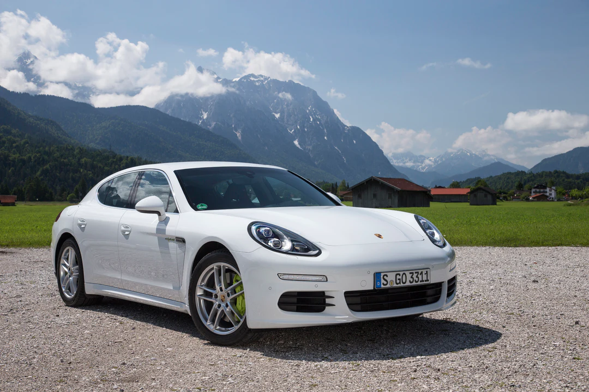
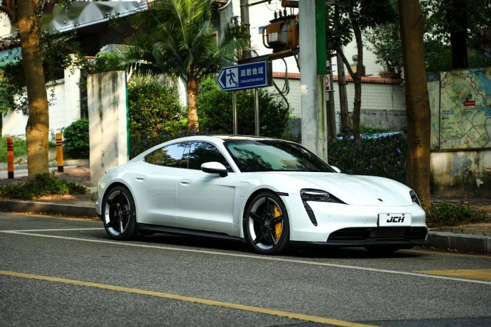
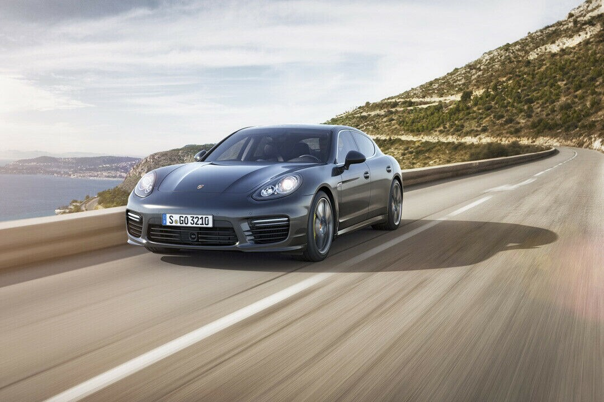
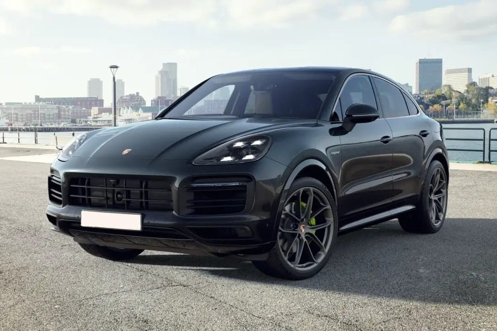

**Unveiling the Powerhouses: The Strongest Porsche Cars**

Porsche, renowned for its precision engineering and iconic sports cars, has created several models that stand out as formidable powerhouses in the automotive world. These cars harmonize cutting-edge technology, high-performance engines, and sleek designs, delivering enthralling driving experiences. Let's delve into some of the strongest Porsche cars that have captivated enthusiasts worldwide:

1. **Porsche 911 Turbo S:**

   The Porsche 911 Turbo S epitomizes performance and luxury. Equipped with a robust 3.8-liter twin-turbocharged flat-six engine, it generates an astonishing 640 horsepower, achieving a rapid 0-60 mph acceleration in just 2.6 seconds. Its refined interior, cutting-edge technology, and track-ready capabilities make it a compelling choice for those seeking ultimate performance in a sports car.

   The exterior design of the 911 Turbo S is a blend of timeless elegance and aerodynamic efficiency. The iconic silhouette, wide rear stance, and retractable rear spoiler not only contribute to its visual appeal but also enhance its performance on the road. The available Lightweight and Sport Design packages add a touch of personalization and further optimize the car's aerodynamics.

   Step inside the 911 Turbo S, and you're greeted by a driver-centric cockpit designed for performance enthusiasts. The Sport Chrono Package, Porsche Communication Management (PCM) system, and 18-way adaptive sport seats ensure a seamless blend of technology and comfort. The 911 Turbo S is not just a sports car; it's a statement of Porsche's commitment to engineering excellence.

2. **Porsche Taycan Turbo S:**
   

   The Porsche Taycan Turbo S represents Porsche's foray into the electric vehicle realm without compromising on performance. Featuring dual electric motors producing up to 750 horsepower, it accelerates from 0 to 60 mph in approximately 2.4 seconds. With its futuristic design and cutting-edge technology, the Taycan Turbo S sets new standards for electric performance cars.

   The exterior design of the Taycan Turbo S is a testament to Porsche's ability to seamlessly integrate electric power with the brand's iconic design language. The sleek silhouette, aerodynamic elements, and distinctive light signature create a striking presence on the road. The available Lightweight Performance package enhances the car's agility and range.

   Inside the Taycan Turbo S, innovation and luxury converge. The futuristic dashboard with multiple digital displays, the Porsche Advanced Cockpit, and the available leather-free interior options showcase Porsche's commitment to sustainability and cutting-edge design. The Taycan Turbo S is not just an electric car; it's a preview of the future of high-performance driving.

3. **Porsche Panamera Turbo S E-Hybrid:**

   The Porsche Panamera Turbo S E-Hybrid combines electrification with high-performance. Fitted with a potent hybrid powertrain delivering 680 horsepower, it offers exhilarating acceleration while providing eco-friendly driving modes. Its luxurious interior and advanced technology redefine the concept of a high-performance luxury sedan.

   The exterior design of the Panamera Turbo S E-Hybrid is a perfect blend of sportiness and elegance. The extended roofline, adaptive rear spoiler, and dynamic lines create a sophisticated yet dynamic appearance. The available Sport Design package adds distinctive elements, further emphasizing the car's performance capabilities.

   Inside the Panamera Turbo S E-Hybrid, comfort meets cutting-edge technology. The adaptive sports seats, available ambient lighting, and the Porsche Rear Seat Entertainment system ensure a luxurious driving experience. The Porsche Communication Management (PCM) system with online navigation and voice control adds a layer of convenience and connectivity.

4. **Porsche Cayenne Turbo S E-Hybrid:**
   

   The Porsche Cayenne Turbo S E-Hybrid blends exceptional performance with SUV versatility. Sporting a hybrid powertrain producing 670 horsepower, it accelerates from 0 to 60 mph in around 3.6 seconds. With its commanding presence, luxurious cabin, and impressive performance, it sets new standards for high-performance SUVs.

   The exterior design of the Cayenne Turbo S E-Hybrid is characterized by its bold grille, distinctive headlights, and sculpted lines. The adaptive roof spoiler and the dynamic design elements not only contribute to its aesthetics but also enhance aerodynamics and performance. The available Lightweight Sport package adds carbon fiber elements for a sportier appearance.

   Inside the Cayenne Turbo S E-Hybrid, the focus is on both performance and comfort. The adaptive sports seats, available panoramic roof, and the Porsche Advanced Cockpit create an upscale driving environment. The versatility of the Cayenne's interior, combined with the latest driver assistance systems, ensures a high level of convenience and safety.

In summary, Porsche's lineup of high-performance vehicles exemplifies a perfect fusion of engineering excellence, innovation, and driving pleasure. Whether it's the iconic 911, the electric Taycan, or the versatile SUVs, each Porsche model showcases unparalleled performance and luxury, captivating enthusiasts worldwide. Porsche continues to push the boundaries of what's possible in the automotive realm, delivering powerhouses that redefine the driving experience.