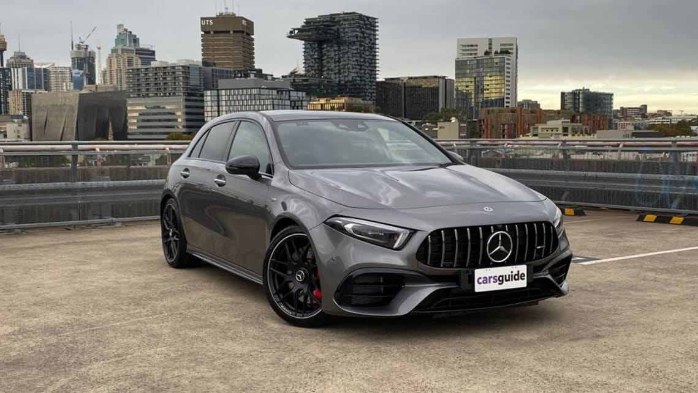

Unveiling the Powerhouses: The Strongest Mercedes-AMG Cars
Mercedes-AMG, renowned for its high-performance and luxury automobiles, has crafted several models that represent the pinnacle of automotive engineering. These vehicles seamlessly integrate advanced technology, potent engines, and sleek designs, offering thrilling driving encounters. Let's explore some of the formidable Mercedes-AMG cars that have enamored enthusiasts worldwide:

1. **Mercedes-AMG GT Black Series:**

The Mercedes-AMG GT Black Series stands as a pinnacle of AMG's engineering excellence, blending remarkable power with track-focused capabilities. Featuring a handcrafted 4.0-liter twin-turbocharged V8 engine, it delivers an astounding 720 horsepower, enabling 0-60 mph acceleration in approximately 3 seconds. With its aerodynamic design and advanced engineering, the GT Black Series provides an unparalleled driving experience for enthusiasts seeking ultimate performance.

2. **Mercedes-AMG E63 S Sedan:**

The Mercedes-AMG E63 S Sedan embodies a perfect fusion of luxury and unbridled performance. Equipped with a potent 4.0-liter twin-turbocharged V8 engine producing 603 horsepower, this sedan achieves 0-60 mph in about 3.3 seconds. Its refined interior, cutting-edge technology, and the renowned AMG Performance 4MATIC+ all-wheel drive system ensure an exhilarating yet comfortable driving experience.

3. **Mercedes-AMG C63 S Coupe:**

The Mercedes-AMG C63 S Coupe is a dynamic and agile performer within the AMG lineup. Sporting a handcrafted 4.0-liter twin-turbocharged V8 engine generating 503 horsepower, this coupe sprints from 0 to 60 mph in around 3.8 seconds. With its sleek design, luxurious cabin, and precise handling, the C63 S Coupe offers an adrenaline-filled driving experience paired with everyday practicality.

4. **Mercedes-AMG G63:**

The Mercedes-AMG G63 is an iconic and powerful SUV that defies conventions. Powered by a handcrafted 4.0-liter twin-turbocharged V8 engine churning out 577 horsepower, this robust SUV achieves 0-60 mph in approximately 4.5 seconds. Despite its rugged exterior, the G63 boasts opulent interiors, advanced technology, and exceptional off-road capabilities.

5. **Mercedes-AMG A45 S:**

The Mercedes-AMG A45 S is a compact yet high-performance hatchback. Featuring a 2.0-liter turbocharged inline-4 engine producing 416 horsepower, it accomplishes 0-60 mph in around 3.9 seconds. With its agile handling, sporty design, and cutting-edge features, the A45 S offers an exciting driving experience in a compact package.

In summary, the Mercedes-AMG lineup epitomizes a harmonious blend of luxury, innovation, and performance across a diverse range of vehicles, setting benchmarks in the automotive world and catering to the desires of performance-driven enthusiasts globally.