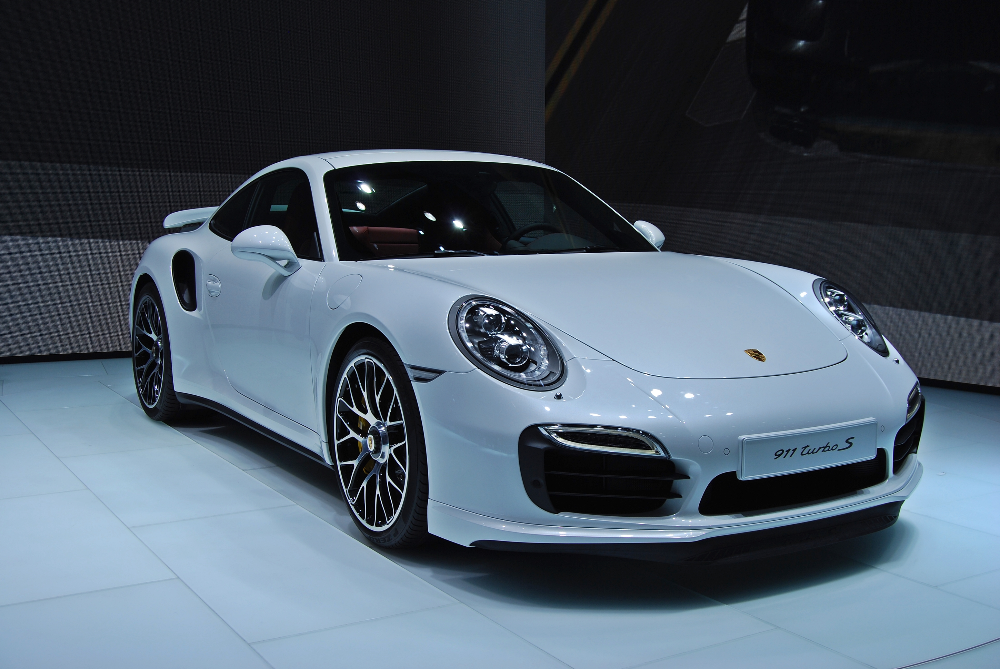
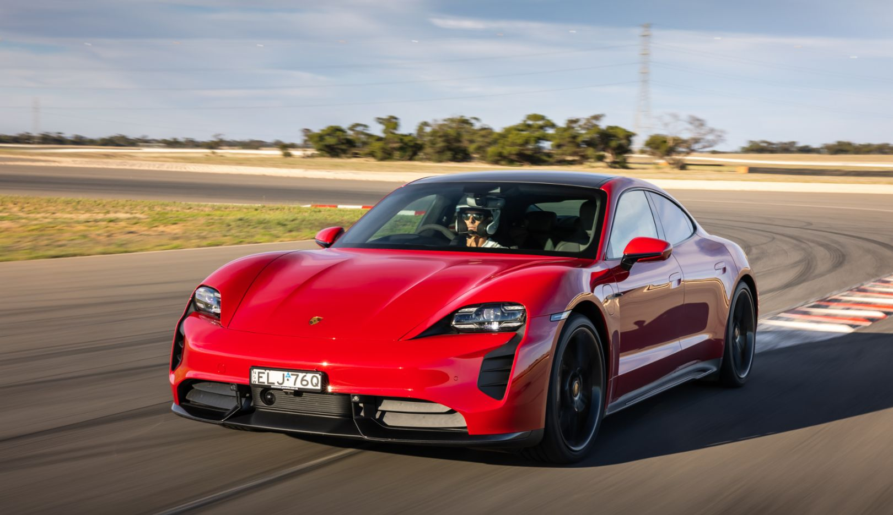
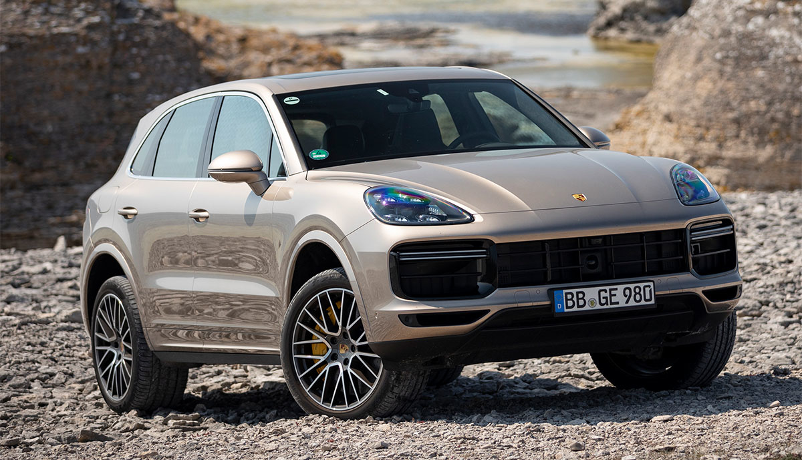

Unveiling the Powerhouses: The Strongest Porsche Cars

Porsche, renowned for its precision engineering and iconic sports cars, has created several models that stand out as formidable powerhouses in the automotive world. These cars harmonize cutting-edge technology, high-performance engines, and sleek designs, delivering enthralling driving experiences. Let's delve into some of the strongest Porsche cars that have captivated enthusiasts worldwide:

1. **Porsche 911 Turbo S:**

   The Porsche 911 Turbo S epitomizes performance and luxury. Equipped with a robust 3.8-liter twin-turbocharged flat-six engine, it generates an astonishing 640 horsepower, achieving a rapid 0-60 mph acceleration in just 2.6 seconds. Its refined interior, cutting-edge technology, and track-ready capabilities make it a compelling choice for those seeking ultimate performance in a sports car.

2. **Porsche Taycan Turbo S:**
   
   The Porsche Taycan Turbo S represents Porsche's foray into the electric vehicle realm without compromising on performance. Featuring dual electric motors producing up to 750 horsepower, it accelerates from 0 to 60 mph in approximately 2.4 seconds. With its futuristic design and cutting-edge technology, the Taycan Turbo S sets new standards for electric performance cars.

3. **Porsche Panamera Turbo S E-Hybrid:**

   The Porsche Panamera Turbo S E-Hybrid combines electrification with high-performance. Fitted with a potent hybrid powertrain delivering 680 horsepower, it offers exhilarating acceleration while providing eco-friendly driving modes. Its luxurious interior and advanced technology redefine the concept of a high-performance luxury sedan.

4. **Porsche Cayenne Turbo S E-Hybrid:**
   

   The Porsche Cayenne Turbo S E-Hybrid blends exceptional performance with SUV versatility. Sporting a hybrid powertrain producing 670 horsepower, it accelerates from 0 to 60 mph in around 3.6 seconds. With its commanding presence, luxurious cabin, and impressive performance, it sets new standards for high-performance SUVs.

In summary, Porsche's lineup of high-performance vehicles exemplifies a perfect fusion of engineering excellence, innovation, and driving pleasure. Whether it's the iconic 911, the electric Taycan, or the versatile SUVs, each Porsche model showcases unparalleled performance and luxury, captivating enthusiasts worldwide.
