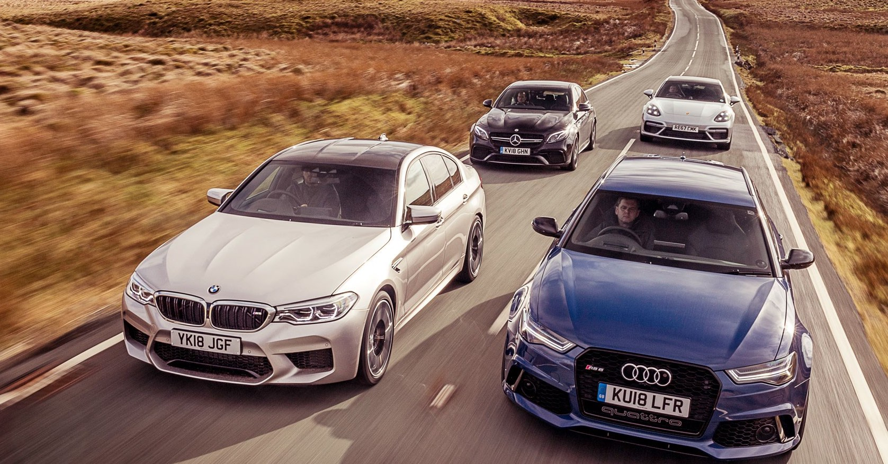

###  Hi, I’m @mohammadmasry
###  I’m interested in German Made Cars
###  Open to collaborations on innovative projects related to German cars! 
###  How to reach me: moe.al.my@gmail.com

# 🏎️ Most Powerful German Cars: A Repository for Car Enthusiasts 

### Welcome to my repository showcasing the **MOST POTENT** cars from prominent German automotive brands! 🚗💨 Explore the sheer power, precision, and performance of high-performance vehicles crafted by these renowned manufacturers.

## [ Car Charectaristics](https://23w-gbac.github.io/MOE350/code(scripts)/mod_Char_table.html).

## The Strongest [👉BMW👈](Cars_Brands/BMW.md) Cars
[Table performance metrics of BMW Cars](Cars_Characteristics/bmw_car_characteristics.md)

Discover the epitome of automotive excellence with the BMW powerhouse lineup, where precision engineering and high-performance converge to redefine driving experiences. From luxurious sedans to dynamic SUVs, BMW's strongest models seamlessly integrate cutting-edge technology, potent engines, and aerodynamic designs. Join us on a journey through some of the most captivating BMW cars that have left an indelible mark on enthusiasts worldwide

## The Strongest [👉AUDI👈](Cars_Brands/Audi.md) Cars
[Table of performance metrics of AUDI Cars](Cars_Characteristics/Audi_car_charectaristics.md)

Explore the world of Audi's powerhouse vehicles in this detailed overview. Renowned for precision engineering and performance-driven designs, Audi's strongest models seamlessly blend cutting-edge technology, high-performance engines, and sophisticated aesthetics. From the sleek Audi RS7 Sportback to the iconic R8 V10 Performance and the versatile Audi SQ5, each car offers a unique combination of power, refinement, and driving pleasure. Dive into this captivating showcase of Audi's high-performance lineup and discover the fusion of elegance and raw automotive power.

## The Strongest [👉MERCEDES-AMG👈](Cars_Brands/Mercedes.md) Cars
[Table of performance metrics of MERCEDES_AMG Cars](Cars_Characteristics/Mercedes_car_characteristics.md)

Embark on a journey through the pinnacle of automotive engineering with Mercedes-AMG's powerhouse lineup. Renowned for seamlessly merging high-performance with luxury, these vehicles embody the epitome of precision, power, and sophistication. Let's explore some of the formidable Mercedes-AMG cars that have captivated enthusiasts worldwide

## The Strongest [👉PORSCHE👈](Cars_Brands/Porsche.md) Cars
[Table of performance metrics of PORSCHE Cars](Cars_Characteristics/Porsche_car_charactaristics.md)

Take a deep dive into the epitome of precision engineering and high-performance with Porsche's powerhouse lineup. Renowned for iconic sports cars, each model stands as a formidable force in the automotive world, harmonizing cutting-edge technology, potent engines, and sleek designs to deliver enthralling driving experiences. Let's uncover some of the strongest Porsche cars that have left an indelible mark on enthusiasts worldwide

### Contributions Welcome:
Passionate about powerful German cars? **CONTRIBUTIONS**, reviews, insights, or captivating car photography focusing on these high-performance vehicles are encouraged! Share your love and knowledge of these German automotive marvels.

### Automation: [Brief Explanation](Automation/Automation.md)

[Automating the Transformation of Colored Images to Black and White](Automation/A1.md)

[Exploring Solutions for Automating German Car Image Transformation](Automation/A2.md)

[Cost-Benefit Analysis](Automation/A4.md)

[Final Solution](Automation/A3.md)

